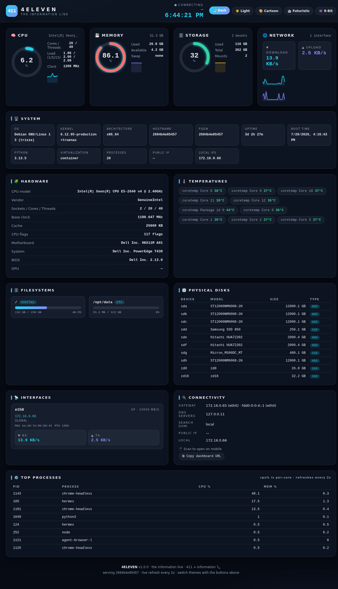
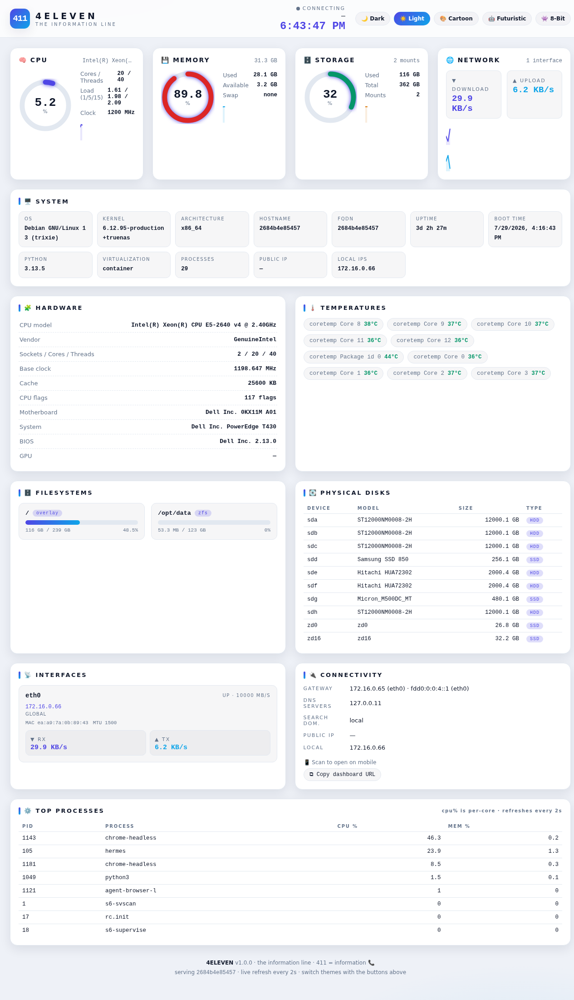
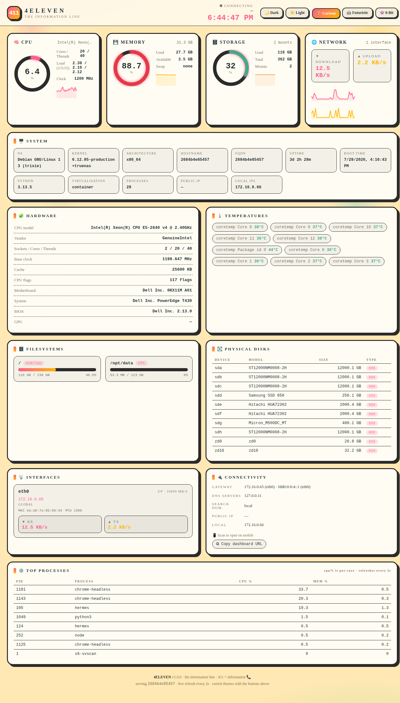
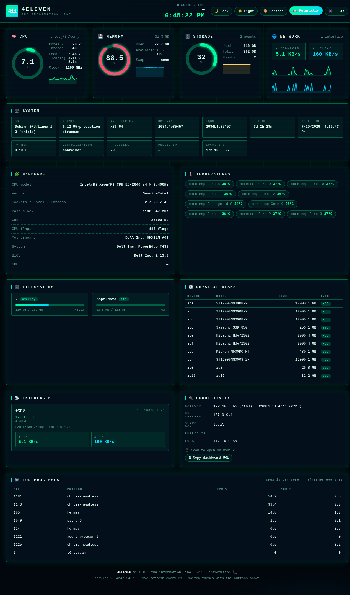
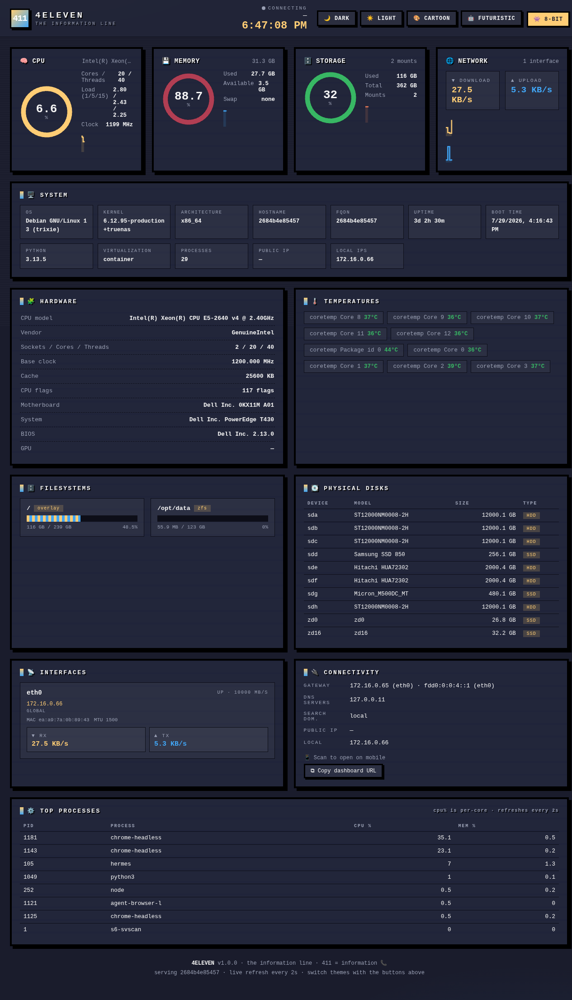

# 4eleven (411) 📞 - the information line

A zero-dependency, one-command server information dashboard. Deploy it on any new server and get a clean, live-updating web dashboard showing system specs, hardware, OS, network, DNS, storage, temps and top processes, with 5 built-in themes.

> **411** = *information*. One number for everything you need to know about a box.



## ✨ Features

- 🚀 **One-command install** - pipe a single curl to bash, done
- 🐍 **Zero dependencies** - pure Python 3 stdlib + vanilla HTML/JS, no pip, no npm, no apt packages
- 📊 **Live metrics** - CPU per-core usage, memory, swap, network throughput, top processes (2s refresh)
- 🧰 **Deep system info** - OS, kernel, motherboard/BIOS (DMI), CPU model/flags, disks with models, temperatures, GPU, virtualization/container detection
- 🌐 **Full network info** - per-interface IPs (v4+v6), MAC, MTU, link speed, gateway, DNS servers, public IP
- 🎨 **5 themes** - 🌙 Dark, ☀️ Light, 🎨 Cartoon, 🤖 Futuristic, 👾 8-bit - switch live, remembered per browser
- 📱 **Fully responsive** - phone/tablet/desktop, plus a QR code for instant mobile access
- 🔒 **Optional token auth**, systemd service with auto-restart, sane defaults
- 🏝️ **Works offline** - no CDNs, no external fonts, no telemetry. The only external call is the optional public-IP lookup (disable with `--no-public-ip`)

## 🚀 Quick Install

```bash
# as root (creates systemd service, installs to /opt/4eleven)
curl -fsSL https://raw.githubusercontent.com/MattDGTL/4eleven/main/install.sh | sudo bash
```

That's it. Open `http://<server-ip>:4110/`.

### Options

```bash
# custom port + password
curl -fsSL https://raw.githubusercontent.com/MattDGTL/4eleven/main/install.sh | sudo bash -s -- --port 8080 --password hunter2

# open the firewall port too
curl -fsSL https://raw.githubusercontent.com/MattDGTL/4eleven/main/install.sh | sudo bash -s -- --open-firewall

# non-root install (no systemd - runs in background)
curl -fsSL https://raw.githubusercontent.com/MattDGTL/4eleven/main/install.sh | bash

# install local checkout (dev mode)
bash install.sh
```

| Flag | Default | Description |
|---|---|---|
| `--port N` | `4110` | listen port |
| `--host A` | `0.0.0.0` | bind address |
| `--password PW` | *(off)* | require token (`?key=PW` or `Authorization: Bearer PW`) |
| `--prefix DIR` | `/opt/4eleven` (root) · `~/.local/share/4eleven` | install dir |
| `--no-service` | off | install files only, don't start anything |
| `--open-firewall` | off | allow the port through ufw/firewalld |
| `--no-auto-python` | off | don't auto-install python3 if missing |
| `--uninstall` | off | remove everything |

Environment overrides: `REPO_RAW`, `PORT`, `HOST`, `PASSWORD`, `DEST`, `OPEN_FIREWALL`.

## 🎨 Themes

Switch themes live from the header - your choice is remembered per browser (`?theme=cartoon` also works).

| Theme | Vibe |
|---|---|
| 🌙 Dark | glassmorphism, cyan/violet neon |
| ☀️ Light | clean, soft shadows |
| 🎨 Cartoon | chunky sticker borders, candy colors |
| 🤖 Futuristic | CRT scanlines, neon grid, HUD glow |
| 👾 8-bit | NES palette, stepped charts, pixel bars |

 
 

## 🔌 API

The dashboard is a thin client over a tiny JSON API - poll it from anything:

```bash
curl -s http://localhost:4110/api/info | jq '.server.os, .stats.cpu.total'
# "Debian GNU/Linux 13 (trixie)"
# 4.2
```

| Endpoint | Description |
|---|---|
| `/` | the dashboard |
| `/api/info` | full system snapshot (static info + live stats) |
| `/healthz` | `{"status":"ok",...}` - for uptime checks |
| `/favicon.ico` | inline SVG favicon |

## 🛠 What it collects (all local, no telemetry)

- **System**: hostname, FQDN, OS, kernel, arch, boot time, uptime, load, process count, Python version
- **CPU**: vendor, model, sockets/cores/threads, cache, flags, live per-core usage, frequency
- **Memory**: total/used/available/cached, swap
- **Storage**: every real filesystem (used/total/%), physical disks with model + type (SSD/HDD)
- **Hardware**: DMI motherboard/system/BIOS, GPU via `lspci` (if present), CPU/board temperatures
- **Network**: per-interface IPs (v4+v6, scoped), MAC, MTU, link speed, rx/tx rates, default gateways, DNS servers, public IP (optional external lookup, cached 5 min)
- **Processes**: top 8 by CPU with memory share

## 🔐 Security

The dashboard shows full system info to anyone who can reach the port: hostname, OS and kernel, hardware details, MAC addresses, process names, and your public IP. Treat it as read-only access to the machine.

- **Set a password for anything beyond your LAN**: `curl ... | sudo bash -s -- --password something-long`
- Rate limiting is on by default (240 requests/min per IP; change with `--rate-limit N`, disable with `--rate-limit 0`)
- Prefer `Authorization: Bearer <token>` over `?key=<token>` (the query form can show up in logs)
- For internet exposure, put it behind a TLS reverse proxy (nginx or caddy) and set a password; the built-in server has no TLS
- The only outbound call is the optional public-IP lookup (disable with `--no-public-ip`)
- No CORS headers, so other websites can't read the API from a viewer's browser
- The docs/ screenshots show a throwaway test container (hostname, MACs, LAN IPs); nothing sensitive

## 📁 Layout

```
/opt/4eleven/
├── server.py        # zero-dependency HTTP + metrics server
├── dashboard.html   # the frontend (themes, charts, live updates)
├── install.sh       # installer / uninstaller
└── uninstall.sh     # convenience uninstaller
/etc/4eleven.conf    # PORT / HOST / PASSWORD
```

## 🧹 Uninstall

```bash
sudo bash /opt/4eleven/uninstall.sh
# or re-run the installer with --uninstall
```

## 🧪 Development

```bash
git clone https://github.com/MattDGTL/4eleven
cd 4eleven
python3 server.py --port 4110 --no-public-ip   # run in place
bash test.sh                                   # run the verification suite
```

## 📜 License

MIT © 2026 4eleven contributors
